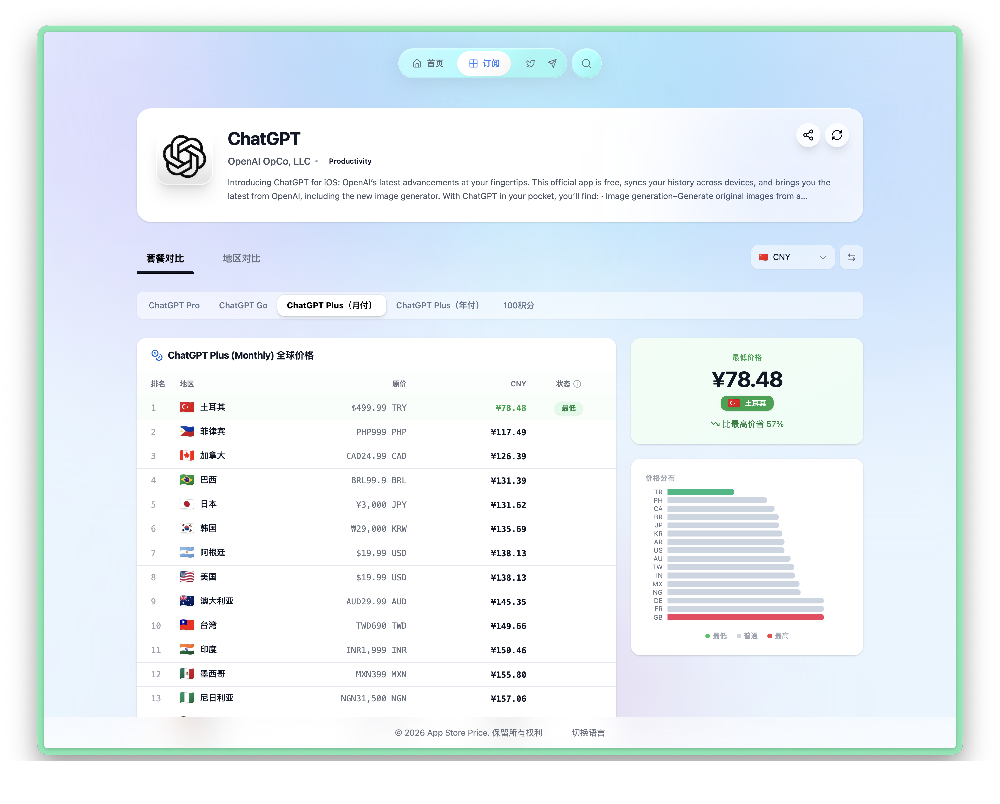
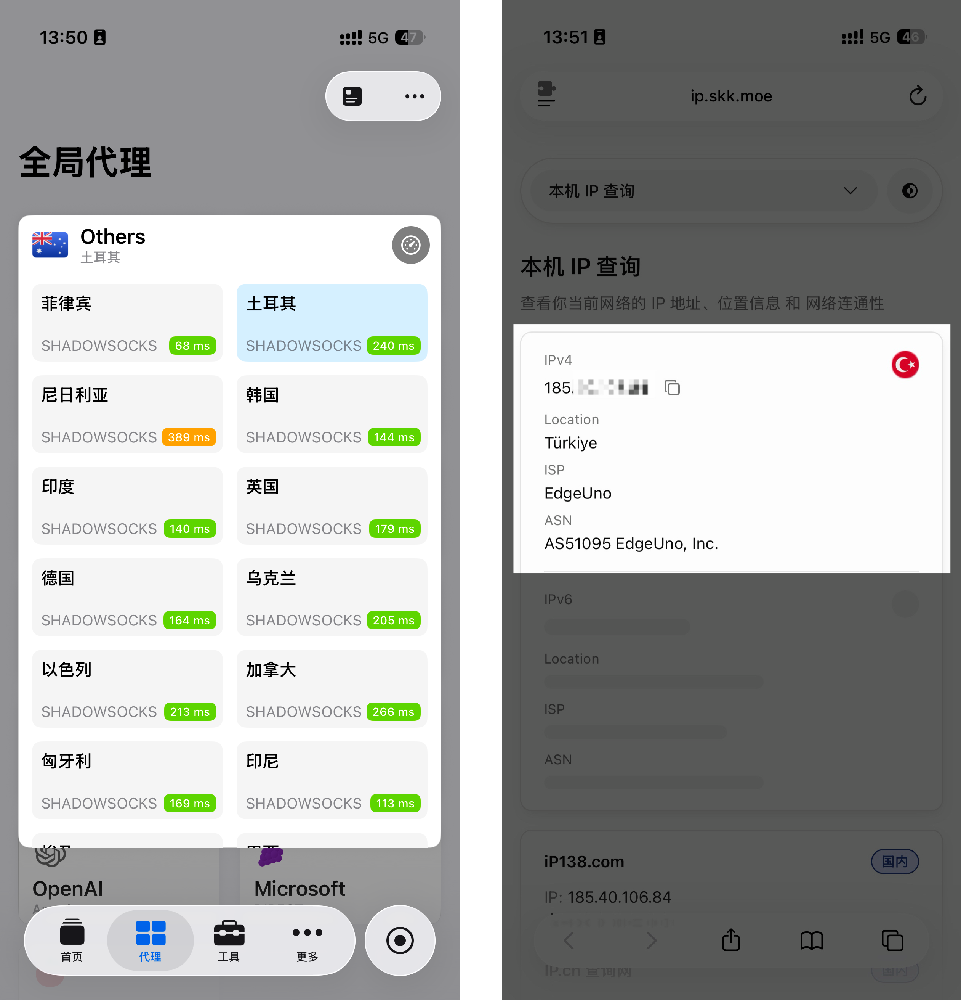
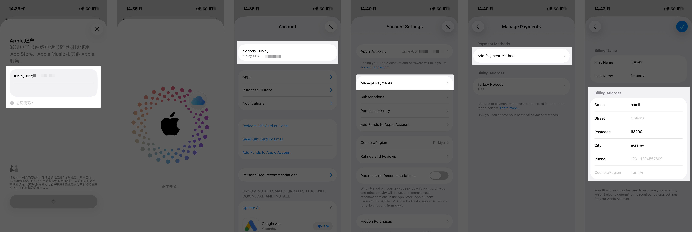

# 外区 Apple ID 注册教程（美区/土耳其/尼日利亚等全区域通用）

> 最后验证时间：2026-03-06 ｜ 美区、日区、土耳其区、尼日利亚区等所有区域的 Apple ID 注册流程完全一致，只需更换对应国家的 VPN 节点。本教程以土耳其区为例演示。

## 为什么要注册外区 Apple ID？

无论你是想注册美区 Apple ID 下载国区没有的 App，还是想注册土耳其、尼日利亚等低价区 Apple ID 来省钱订阅 AI 服务，注册流程都是一样的。**唯一的区别就是你使用的 VPN 节点不同。**

以 ChatGPT Plus 为例，美区定价 $19.99/月，而土耳其区折合人民币仅约 ¥78。通过注册低价区 Apple ID，再充值对应区域的礼品卡，就可以用 App Store 内购的方式以低价订阅这些服务。

你可以在 [App Store Price](https://appstoreprice.org/zh/apps/6448311069) 查看各区域的价格差异，选择最适合你的区域。

## 准备工作

- **一台 iOS 设备**：iPad 或 iPhone 均可，对系统版本没有要求
- **对应区域的网络节点**：用于打开注册页面（注册土耳其区就需要土耳其节点）
- **一个邮箱**：用来接收验证码（推荐使用 Gmail 或 Outlook）
- **一个中国手机号**：用来接收验证码，同时作为 Apple ID 双重认证的凭证手机号

## 第一步：验证节点

切换到对应区域节点后，先打开 IP 验证网站确认节点是否生效。推荐使用 https://ip.skk.moe ，页面简洁，信息清晰。

> 如果你的代理服务没有提供土耳其节点，可以选择其他有节点的低价区进行注册。

## 第二步：注册账号

打开 Apple ID 注册页面：https://account.apple.com

> 苹果之前的地址是 https://appleid.apple.com ，目前两个地址都可以使用。

注册时的关键点：

1. **国家/地区**必须与你的 VPN 节点一致（例如节点是土耳其，就选择 Turkey）
2. 邮箱填写你准备好的邮箱
3. 手机号可以直接使用中国手机号，正常接收验证码即可
4. 按页面提示完成邮箱验证和手机验证

完成注册后，这个 Apple ID 就可以在你的 iPhone/iPad 的 App Store 中登录了。

## 第三步：填写付款地址

登录 App Store 后，需要去填写 Payment Address（付款地址）。虽然我们没有土耳其的支付方式，但地址信息是必须填写的，否则后续购买时会被要求补充。

**地址获取方式**：从 Google Maps 上随便找一个土耳其的地址即可。

不需要填写非常详细，只需要填写：
- 城市
- 街道
- 邮编

手机号直接填写注册时使用的中国手机号，不需要加 +86 前缀，直接输入 1xx 开头的号码。这一步不需要接收任何验证码。

## 常见问题

**Q: 注册时提示"此 Apple ID 无效"怎么办？**
A: 确保你的网络节点与选择的国家/地区一致，建议使用浏览器无痕模式重新注册。

**Q: 可以用同一个手机号注册多个外区 Apple ID 吗？**
A: 可以。同一个中国手机号可以绑定多个不同区域的 Apple ID。

**Q: 注册完成后是否需要一直挂着对应节点？**
A: 不需要。注册时需要对应节点，注册完成后日常使用 App Store 下载 APP 和购买订阅不需要挂节点。

**Q: 已有的 Apple ID 可以直接转区吗？**
A: 技术上可以，但不推荐。转区需要取消所有订阅且余额清零，容易出问题。建议直接注册新的。

---

完成 Apple ID 注册后，下一步是 [购买礼品卡并充值](./02-buy-gift-card.md)。
