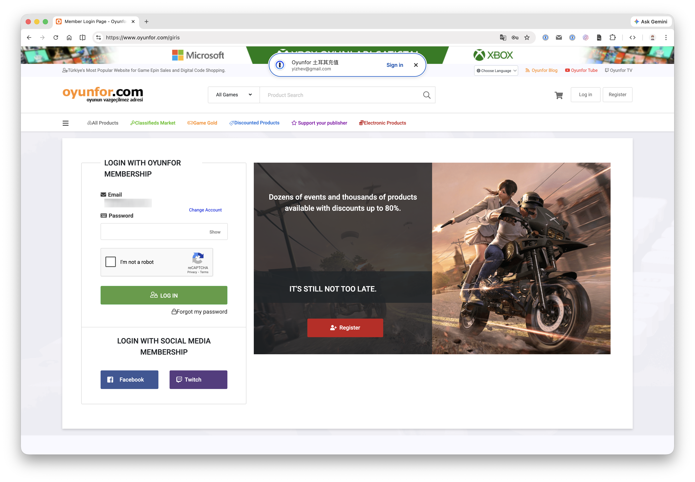
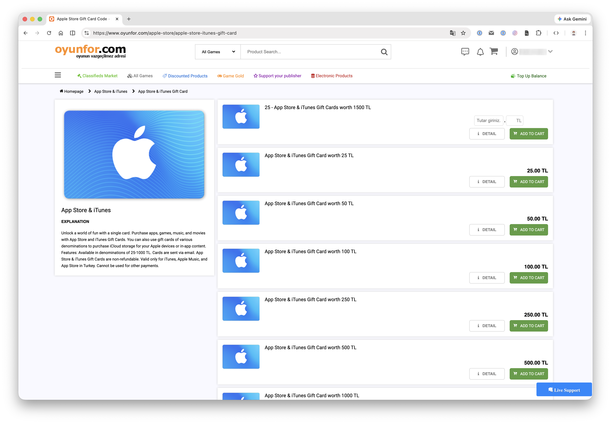
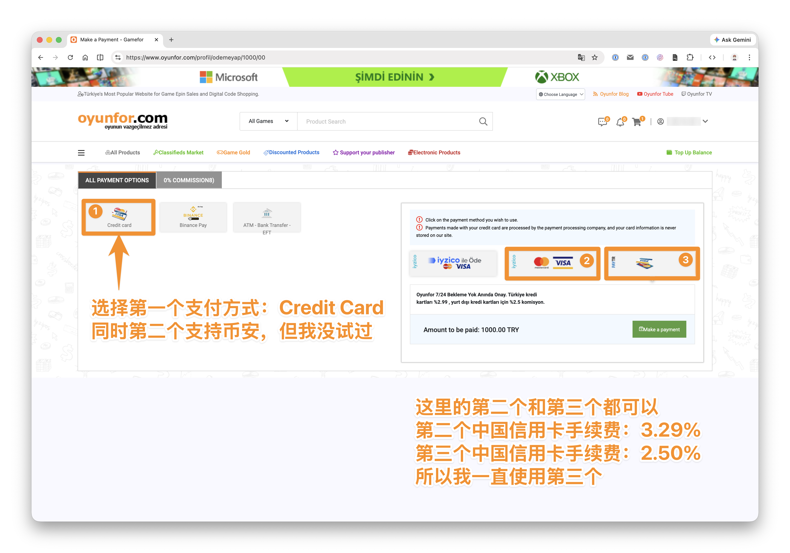
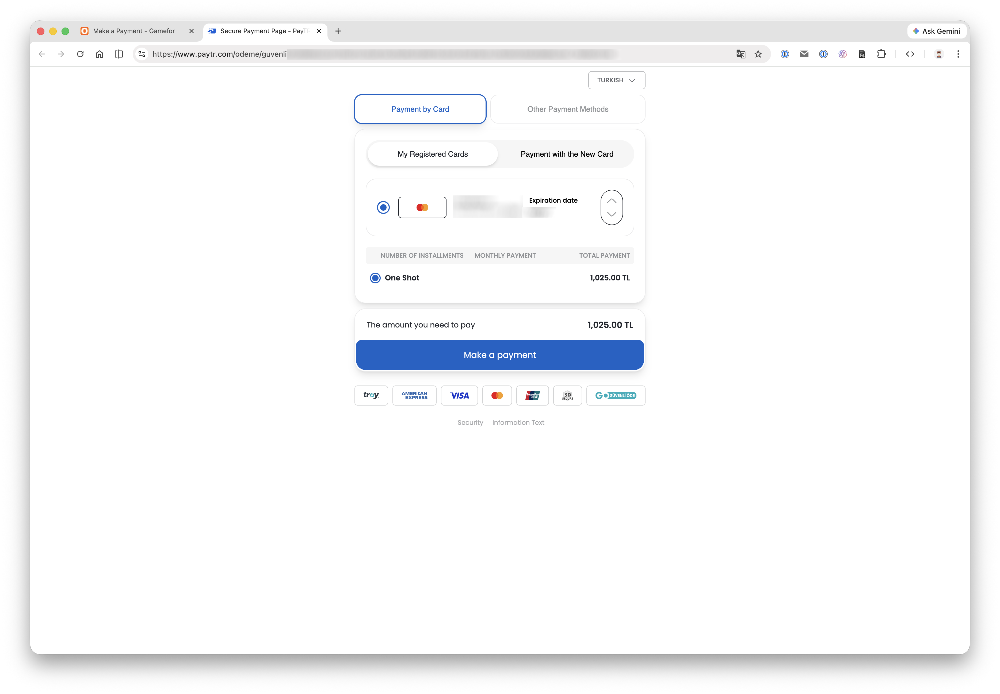
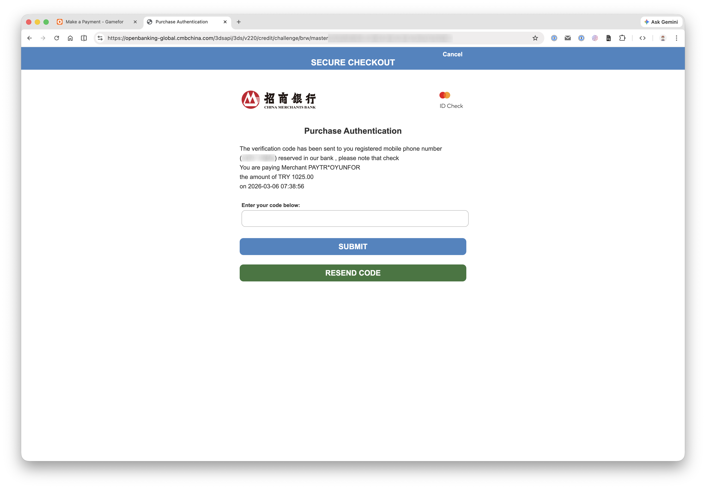
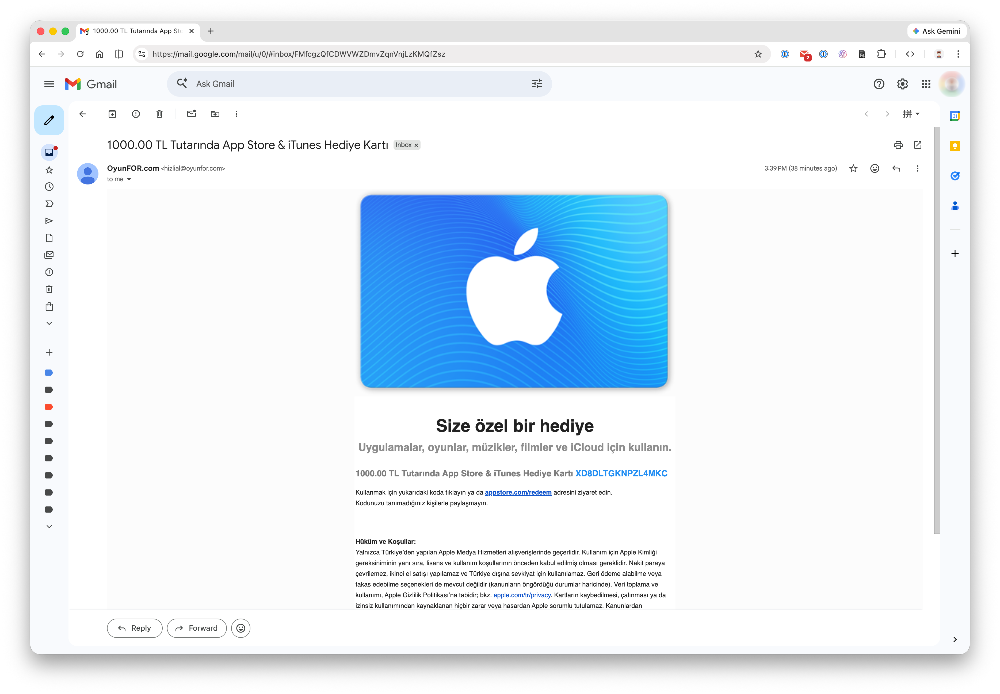
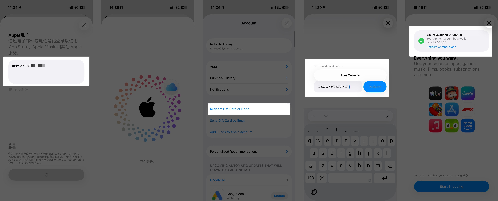

# 土耳其区 App Store 礼品卡购买与充值

> 本教程以土耳其区为例。其他区域（如尼日利亚区）的礼品卡可通过闲鱼等渠道购买，流程类似。

## 购买渠道概览

| 区域 | 购买渠道 | 是否需要信用卡 |
|------|---------|--------------|
| 土耳其区 | 淘宝/闲鱼 或 oyunfor.com 在线购买 | 线上购买需要 VISA/MasterCard |
| 尼日利亚区 | 闲鱼 | 不需要 |
| 其他区域 | 淘宝/闲鱼搜索对应区域礼品卡 | 不需要 |

> 淘宝/闲鱼购买方式：搜索对应区域名称 + "礼品卡"，按销量排序选择即可。购买后会自动发送兑换码。

如果你没有 VISA/MasterCard，直接从闲鱼购买礼品卡兑换码即可，可以跳到本文最后的 [兑换礼品卡](#兑换礼品卡) 部分。

---

## 通过 oyunfor.com 在线购买（需要 VISA/MasterCard）

[oyunfor.com](https://www.oyunfor.com) 是土耳其的数字商品购物平台（Türkiye's Most Popular Website for Game Epin Sales and Digital Code Shopping），支持购买土耳其区 App Store 礼品卡。

> 网站默认是土耳其语，可以使用浏览器自带的翻译功能翻译为中文或英文。

### 1. 打开网站

### 2. 注册并登录

点击右上角注册账号，完成后登录。登录成功后右上角会显示你的用户名。

### 3. 选购礼品卡

点击页面上方的 App Store 礼品卡入口（如果没有推荐位，可以直接搜索 "App Store"），选择需要的面值，添加到购物车。

### 4. 选择支付方式

以购买 1000 TL（土耳其里拉）为例：

平台支持信用卡和币安 Pay 支付。信用卡支付有三个选项：

- **第一个**：需要土耳其本地支付方式（一般用不了）
- **第二个**：VISA/MasterCard 支付（手续费较高）
- **第三个**：VISA/MasterCard 支付（手续费较低，**推荐**）

### 5. 完成支付

选择支付方式后，输入信用卡信息（卡号、有效期、CVV）。页面会显示礼品卡金额 + 手续费的总价。

点击支付后，接收银行验证码完成付款。

### 6. 获取兑换码

支付完成后，几分钟内会收到 oyunfor 发来的邮件，里面包含礼品卡兑换码。如果一次购买了多张，所有兑换码会在同一封邮件中。

---

## 兑换礼品卡

拿到兑换码后，在 iPhone/iPad 上打开 App Store，确保已登录对应区域的 Apple ID，然后：

1. 点击右上角头像
2. 选择"兑换礼品卡或代码"
3. 输入兑换码，完成充值

充值成功后，余额会显示在 App Store 账户中，后续就可以用来购买订阅了。

---

充值完成后，下一步是 [订阅 ChatGPT / Claude 会员](./03-subscribe-ai.md)。
