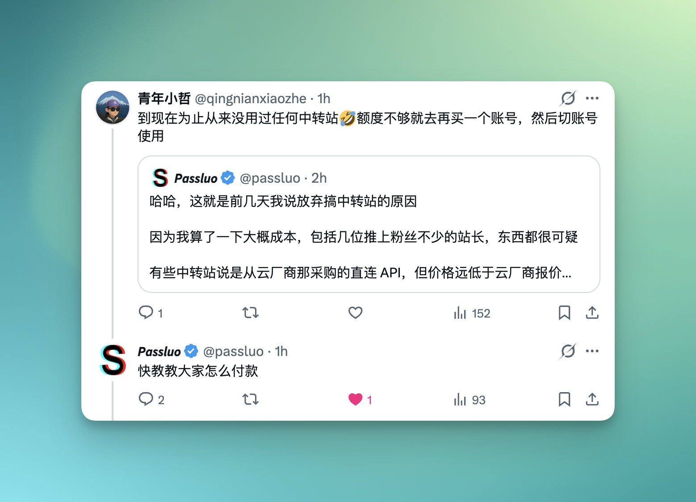
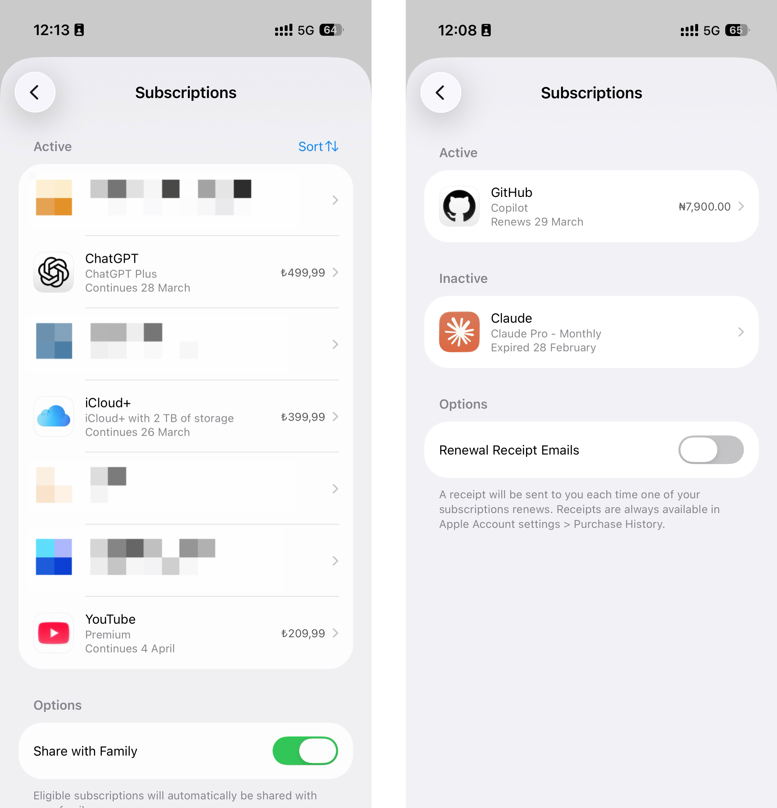
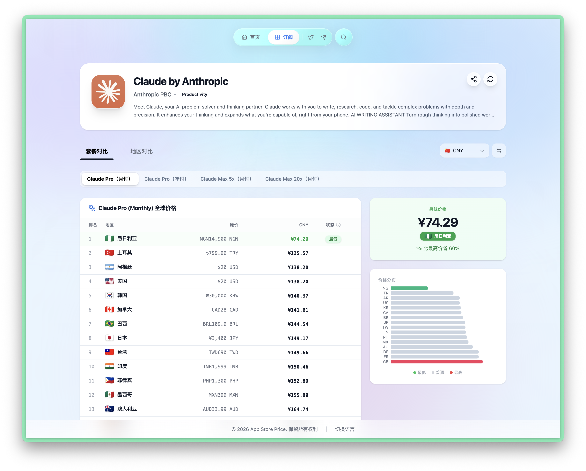

# ChatGPT / Claude 会员订阅

> 通过 App Store 内购订阅 AI 服务，正规渠道、稳定续费、不会封号。

## 核心结论

如果你没有海外信用卡，**App Store 内购是当前最稳定、最可靠的 AI 服务订阅方式**。没有灰产、没有黑卡，全部来自正规渠道。

## 背景：为什么不用中转站？

推特上有人分享了一篇 AI 中转站审计论文，结论是：国内大多数 AI 中转站提供的并非官方满血 API，甚至不是同一个模型。当你看到中转站价格远低于官方时，价格本身就说明了问题。

## 我的真实订阅

从 2023 年开始重度使用至今，我没有用过任何中转站。当前持续订阅的服务：

- **ChatGPT Plus** — 2023 年注册，持续使用至今，从未被封号
- **Claude Pro 账号 x2** — 2024 年中开始订阅，稳定使用超一年（两个账号相当于 2x 额度）
- **GitHub Copilot Pro** — 2024 年开始订阅，断续续订至今

> 上面的 App Store 订阅截图有两张，因为来自两个不同区域的 Apple ID。

## 订阅 ChatGPT Plus

### 确认最低价区域

在 [App Store Price](https://appstoreprice.org/zh/apps/6448311069) 查看 ChatGPT Plus 各区定价。土耳其区月付折合约 **¥78**（美区原价 $19.99）。

### 操作步骤

1. 在 App Store 登录你的土耳其区 Apple ID
2. 使用该 Apple ID **下载 ChatGPT App**（如果之前用其他区 ID 下载过，需要先删除再重新下载）
3. 打开 ChatGPT，登录你的 ChatGPT 账号
4. 选择 Plus 订阅，通过 App Store 内购完成支付

### 后续续费

- 开启自动续费后，确保 Apple ID 余额充足即可自动扣款
- 余额不足时，按 [礼品卡购买教程](./02-buy-gift-card.md) 再次充值

## 订阅 Claude Pro / Max

### 确认最低价区域

同样在 App Store Price 查看 Claude 的各区定价。对于 Claude，**尼日利亚区**价格最有优势：

| 套餐 | 尼日利亚区价格（折合人民币） |
|------|------------------------|
| Pro 月付 | ≈ ¥74 |
| Max 5x 月付 | ≈ ¥498 |
| Max 20x 月付 | ≈ ¥997 |

这些价格订阅到的是 **100% 官方原版模型**，没有任何替换和缩水。

### 多账号叠加用法

如果一个 Claude Pro 账号的额度不够用，又暂时买不起 Max：

1. 用同一个尼日利亚区 Apple ID 订阅第二个 Claude 账号的 Pro
2. 第一个账号额度用完后，在 Claude App 内切换到第二个账号继续使用
3. 两个 Pro（≈ ¥148）< 一个 Max 5x（≈ ¥498），变相实现 2x 额度且更省钱

### 操作步骤

与 ChatGPT 类似：

1. 在 App Store 登录对应区域的 Apple ID（Claude 推荐尼日利亚区）
2. 下载 Claude App
3. 打开 Claude，登录你的 Claude 账号
4. 选择 Pro 或 Max 订阅，通过 App Store 内购支付

## 注意事项

- **不同 AI 服务的最低价区域可能不同**，购买前务必先查价
- App Store 内购订阅是正规渠道，不会因为支付方式导致封号
- 如果你同时需要 ChatGPT 和 Claude，可能需要注册不同区域的 Apple ID（土耳其区买 ChatGPT，尼日利亚区买 Claude）
- 订阅价格可能随汇率和平台调整变动，以实际购买时的价格为准

---

> 关于如何保证 Claude 账号不被封号、稳定使用，这是另一个话题，后续会另写文章介绍。
